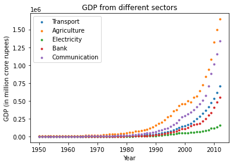
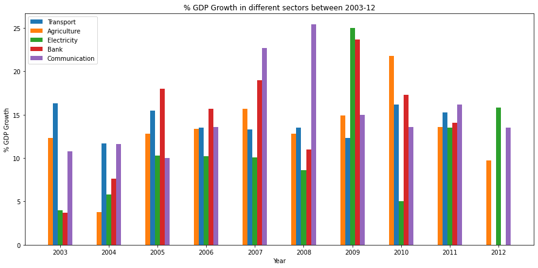
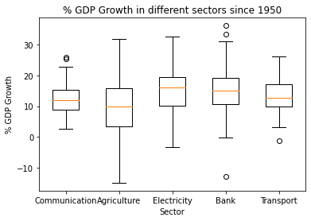

# DS200
## Historical Analysis of GDP Contribution from Key Sectors in India

In this work, we do analysis of contribution to India's GDP from different key sectors such as Agriculture, Electricity, Communication, Banking, and Transport. We find that historically the contribution from agriculture sector has been the highest. We observe that the economic activities grew exponentially upon liberalisation of economy in 1991.  

We then analyse the % growth rate of these sectors. In last 10 years, the sectors saw a steady growth till the 2008 economoc crisis, post which some sectors' growth rate started diminishing. Electricity and Communocation saw a major change in its growth during 2010-11, with a drop of more than 20%.  

When the historical GDP growth is analysed, it is seen that communication and banking sector are the most volatile whereas the transport sector is the least volatile.  

### References:
[1] Gross Domestic Product by Economic Activity at Current Prices - From 1950-51 to 2013-14 (as on 30.05.2014) https://data.gov.in/resources/gross-domestic-product-economic-activity-current-prices-1950-51-2013-14-30052014
